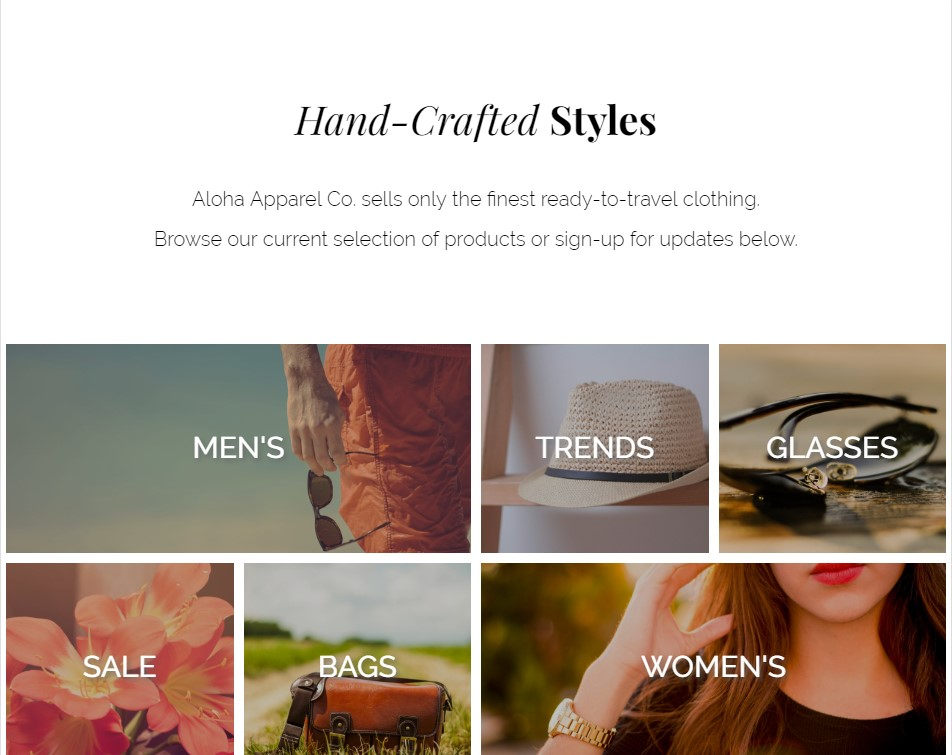
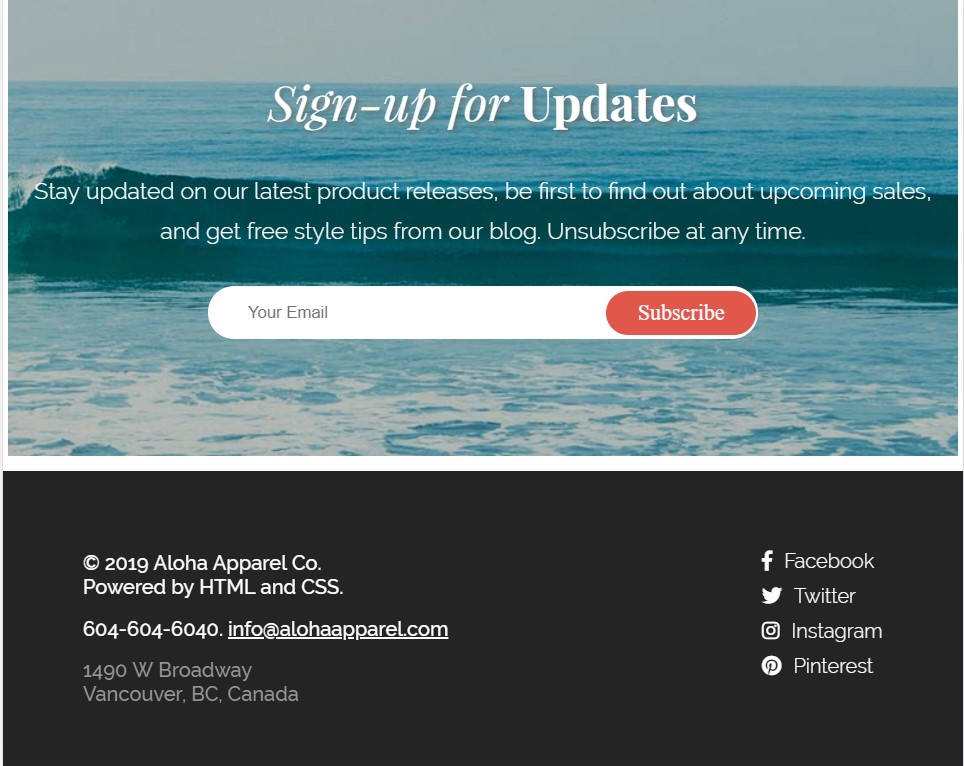

# Project Aloha Apparel Co

## Project Overview

The Project Aloha homepage was created to demostrate effective use of HTML and CSS. It is a mobile-first responsive layout 
with flexbox and is optimized for three screen sizes - Mobile 480px, Tablet 768px, and desktop. The HTML is syntactically-valid HTML5 code,
which the head includes linked stylesheets for CSS, stylized custom fonts, and a Flickity carousel. The HTML has been written with semantically-appropriate HTML elements, while the CSS demostrates effective use of flexbox properties, box model properties and appropriate CSS selectors.  A list-based navigation menu has been incorporate which smooth scrolls to specific sub-headings within the page. A Flickity image slider has been implemented for an image slider. Javascript was used to display an alert box that says �Thanks for subscribing!� whenever a user successfully submits the newsletter form with a valid email address, otherwise the alert box asks for the user to enter a valid email address. As a first project, Project Aloha is important to me because it shows effective use of HTML and CSS fundamentals and some Javascript.

## Functionality:
1. Smooth-scroll to desired sections on the website by clicking on the navigation items.
2. Image carousel for 'Most Loved Products'.
3. Email alert box that checks for valid email syntax.

## HTML

HTML5 doctype

## CSS

* Mobile responsive layout
* Implements Product Type Categories layout with flexbox
* Incorporate custom fonts using @font-face
* Uses Font Awesome for icon fonts

## JS/jQuery

* Incorporates a smooth scroll
* Checks for valid email syntax

## Personal Learnings

* HTML
* CSS
* Flexbox
* Responsive Web Design
* Command Line Interface
* Git
* JavaScript
* jQuery
